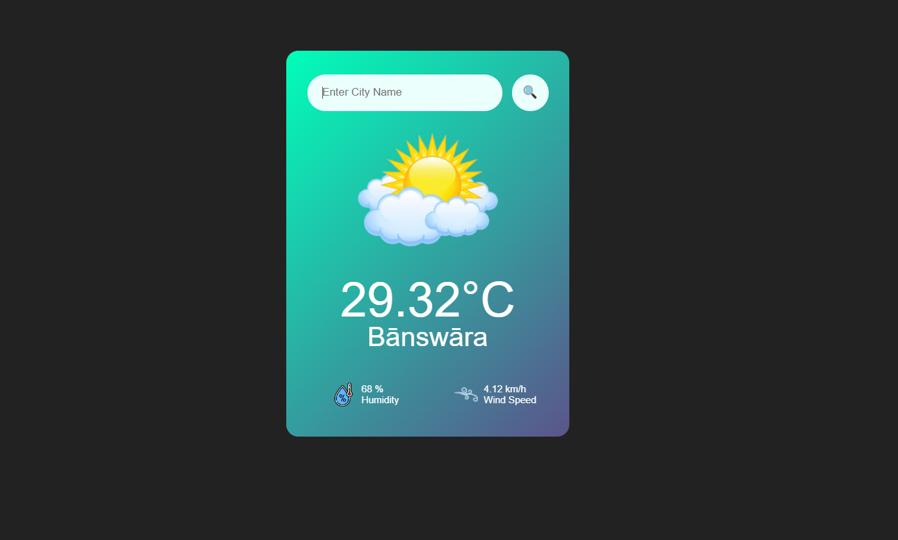

# 🌤️ Weather Application

A sleek, responsive Weather App built with **HTML**, **CSS**, and **JavaScript** using the **OpenWeatherMap API**. Enter any city name and instantly get the current weather, including temperature, humidity, and wind speed — all with dynamic visuals and a clean UI.

 

---

## 🚀 Features

- 🔎 **City-based search** for real-time weather
- 🌡️ Displays **temperature**, **humidity**, and **wind speed**
- 🌥️ Dynamically updates **weather icons** based on condition
- ❌ Handles **invalid city input** gracefully
- 🎯 Minimal, centered layout with responsive design
- ⚙️ Built with pure frontend technologies – no frameworks!

---

## 🛠️ Tech Stack

- **HTML5**
- **CSS3**
- **Vanilla JavaScript**
- **OpenWeatherMap API**

---

## 📁 Project Structure

```
weather-app/
│
├── index.html           # Main HTML file
├── style.css            # Styling
├── index.js             # JavaScript logic
├── images/              # Weather icons (clear.png, rain.png, etc.)
├── screenshots/         #  Demo screenshot
└── README.md            # You're here!
```

---

## 🔑 Getting an API Key

This project uses the [OpenWeatherMap API](https://openweathermap.org/api).

1. Sign up at [openweathermap.org](https://openweathermap.org/)
2. Go to your profile → API keys
3. Copy the API key and paste it inside `index.js`:


---

## 🔧 How to Run the Project

1. Clone the repository:

```bash
git clone https://github.com/your-username/weather-app.git
```

2. Open the project folder and launch `index.html` in your browser:

```bash
cd weather-app
```

3.  Use Live Server in VS Code or host via GitHub Pages/Netlify.

---

## ✨ Demo

[Live Demo Here](#)

---


## 🧠 Learnings

This project demonstrates:
- DOM manipulation
- Async/await with `fetch()`
- Error handling in API calls
- Clean UI logic & conditionally rendering sections
- Basic frontend architecture without frameworks

---

## 🧑‍💻 Author

**Divyansh Joshi**  
B.Tech. CSE Student 

---
## Note 
The API key is exposed as this is only a frontend project with no backend proxy server . I have just made the project to practice and strenghten my HTML , CSS AND JS concepts . Further projects coming up !
